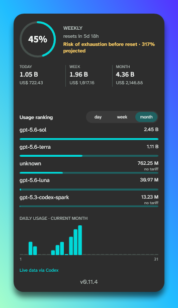
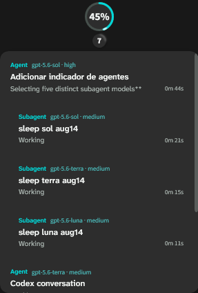

# Codex Tracker

A native Windows widget for Codex weekly quota, local usage analytics, and live agent activity.

<p align="center">
  
  
</p>

<p align="center"><sub>Screenshots show the v0.11.4 interface; the latest release may be newer.</sub></p>

## What it does

- Compact and detailed widget modes for an at-a-glance or full view.
- Weekly Codex quota, reset countdown, and exhaustion-risk forecast.
- Local token and estimated API-equivalent cost analytics for today, the active quota week, and the current month.
- Model ranking and a daily usage chart.
- Live agents and subagents with their current status, model, reasoning effort, duration, hierarchy, and a deep link to the related Codex chat.
- Light/dark themes, user-selected accent color, BRL/USD display, settings, tray controls, persistent placement, and always-on-top preference.
- Full interface support for **Portuguese (Brazil)** (`pt-BR`, default) and **English (United States)** (`en-US`).

## Requirements

- Windows 10 22H2 or newer, or Windows 11.
- An authenticated Codex CLI installation. Codex Tracker reads the official quota through the Codex CLI app-server.
- The released app targets **.NET Framework 4.8** (`net48`).

## Install

Download and run the installer from the [latest release](https://github.com/luingry/codex-tracker/releases/latest). The installer preserves your local settings and the application detects `codex.exe` automatically when possible.

## Data and privacy

The weekly quota comes from the local Codex CLI app-server. Tokens, model ranking, charts, and costs are reconstructed from the local Codex history (`~/.codex`). No account history is uploaded by the widget.

Local-history analytics cover only the Codex data available on this Windows machine; they are not a cross-device total. Cost values are **estimated API equivalents**, not real Codex billing or an invoice.

## Development

```powershell
dotnet build .\CodexTracker.sln
dotnet run --project .\tests\CodexTracker.Tests\CodexTracker.Tests.csproj
.\scripts\finalize-build.ps1
```

The generated installer is `artifacts\CodexTracker-latest.exe`.

## License

[MIT](LICENSE).
