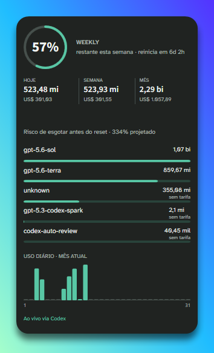

# Codex Tracker

Widget nativo para Windows que acompanha a quota semanal do Codex e transforma o histórico local do CLI em métricas simples de uso.



## O que mostra

- Percentual semanal restante, reset e previsão de esgotamento.
- Tokens e custo estimado para hoje, a janela semanal vigente e o mês.
- Ranking de modelos e gráfico diário do mês, com tooltip por dia.
- Modos compacto e detalhado, temas claro/escuro, moeda BRL/USD, always-on-top, arraste e redimensionamento.

## Instalar ou executar

Requisitos: Windows 10/11, Codex CLI autenticado e .NET 8 SDK apenas para desenvolvimento.

```powershell
git clone https://github.com/luingry/codex-tracker.git
cd codex-tracker
.\scripts\finalize-build.ps1
```

O instalador gerado fica em `artifacts\CodexTracker-latest.exe`. Para executar sem empacotar:

```powershell
dotnet run --project .\src\CodexTracker\CodexTracker.csproj
```

O app detecta o `codex.exe` no PATH ou na instalação do Codex. Caso necessário, escolha o caminho nas configurações do widget.

## Como os dados são calculados

A quota semanal vem do `codex app-server`, portanto acompanha o valor exibido pelo próprio Codex. Os tokens, ranking, gráfico e custos são calculados apenas a partir dos JSONL locais em `~/.codex`; representam a atividade disponível neste computador, não uma fatura nem um uso consolidado de outros dispositivos.

## Desenvolvimento

```powershell
dotnet build .\CodexTracker.sln
dotnet run --project .\tests\CodexTracker.Tests\CodexTracker.Tests.csproj
```

Após toda alteração funcional, gere o instalador com `scripts\finalize-build.ps1`.

## Licença

[MIT](LICENSE).
